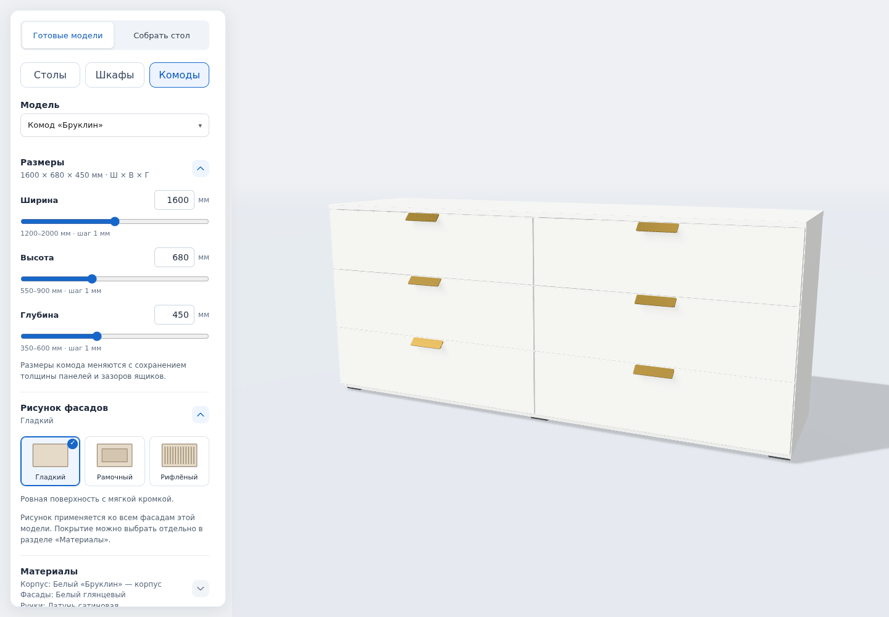
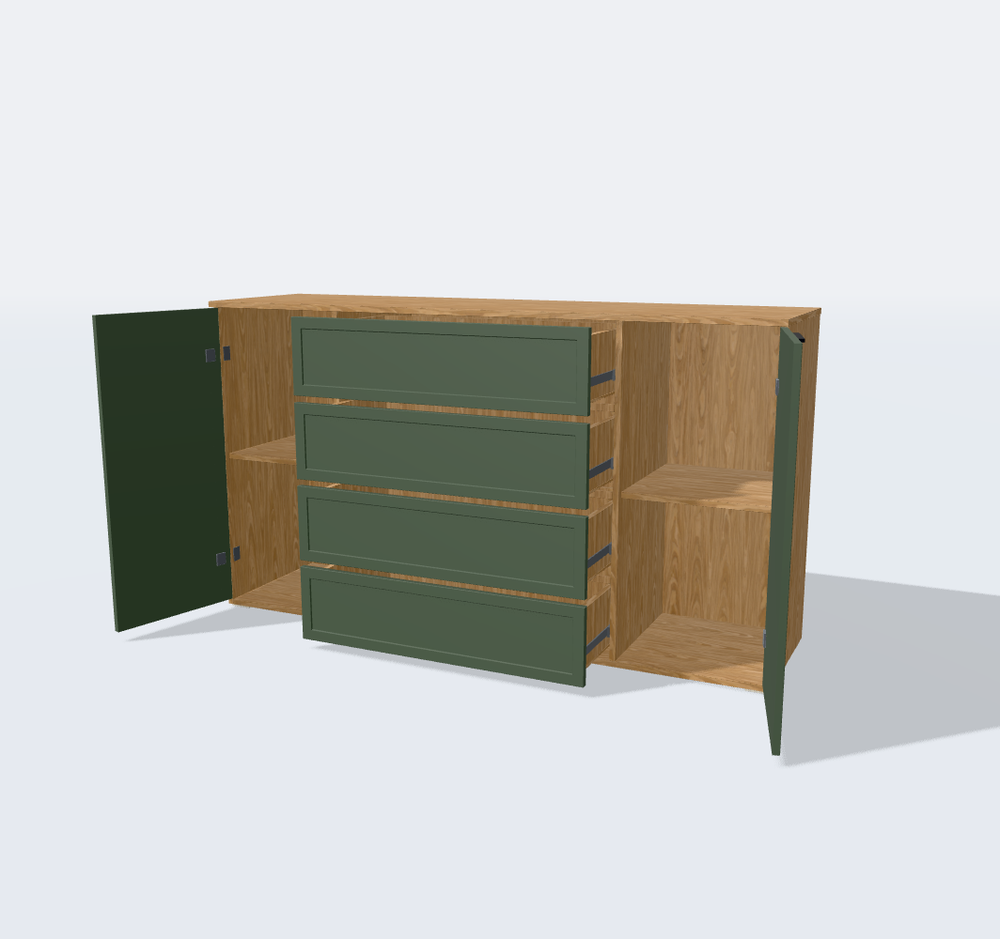

# Проверки cabinet-views-facades-v2

22 сентября 2026; основа — принятый пользователем `facade-variants-v1`.

## Автоматические проверки

- `npm test -- --testTimeout=30000`: **395 тестов / 45 файлов, PASS**.
  Первый общий запуск со стандартным лимитом 5 секунд завершился двумя
  тайм-аутами прежних тяжёлых тестов кромок столешниц при параллельной работе
  программного WebGL. Повторный полный запуск с лимитом 30 секунд прошёл.
- `npm run build`: PASS; прежнее предупреждение Vite о размере 3D chunk.
- ESLint всех 20 изменённых TS/TSX: PASS.
- Генераторы интеграции 07–09, 10–14 и авторинг «Катании» выполнены; ни один
  исходный GLB не изменился относительно принятой базы.

Проверяются реальные GLB всех девяти моделей, все допустимые стили и
min/base/max габариты: толщина, задняя монтажная плоскость, принадлежность
подвижной сборке, замена и освобождение геометрии, восстановление исходных
детей, сохранение промежуточной позы и независимость покрытий. В «Наполнении»
двери скрываются, ящики остаются доступными.

Отдельно проверены лучами реальные монтажные участки ручек шкафов 08/15,
«Норда» и обычного/декоративного ящиков «Байкала». Новый профиль не убирает
опору из-под существующих концов ручек. У изогнутых ручек исходное небольшое
вхождение концов в панель учитывается, а не ошибочно считается воздушным зазором.

Тесты камеры проверяют общий масштаб шкафов, цель по центру каждого комода,
видимость низа при приближении, возврат ракурсов и изменение высоты без смены
расстояния или пользовательского смещения цели. Сохранения проверены для всех
девяти моделей: стили, reset, ссылки и старые варианты v1/v2/v3 без поля стиля.

## Браузер

Локальная production-сборка с временным QA-доступом к состоянию; Chromium,
программный WebGL. QA-доступ не входит в исходники обновления.

- **30 сочетаний** модели и стиля: видимость исходных/новых поверхностей,
  количество новых панелей, сохранение открытого состояния при смене рисунка.
- Шкаф → «Бруклин», настоящее приближение колёсиком на 400 единиц, возврат
  шкафа и комода: цели и сохранённые позиции совпадают, низ комода в кадре.
- Изменение высоты «Бруклина» до 900 мм перемещает цель на 450 мм и сохраняет
  вектор от цели к камере. У всех пяти комодов цель соответствует текущей высоте.
- Настоящие клики по новым фасадам «Катании», «Марвэла» и «Байкала» открывают
  соответствующую часть; возврат «Исходного» восстанавливает родной декор.
- Древесина на рифлении «Байкала», зелёное покрытие «Марвэла», восстановление
  выбранного рисунка после перезагрузки страницы.
- **390 × 844 и 320 × 844**: «Бруклин», «Байкал», «Катания» в кадре;
  горизонтального переполнения страницы и панели нет.
- Два PNG скачаны через интерфейс: приближённый «Бруклин» и рамочный
  «Марвэл» с открытыми частями. Камера, размер canvas и открытая поза не меняются.
- Ошибок страницы, `console.error` и HTTP ≥ 400 в этих сценариях нет.

[Численные результаты браузера](validation/cabinet-views-facades-v2/browser-report.json).

## Геометрический бюджет при базовых размерах

Только новые панели, без корпуса, ручек и теневых проходов. Исходные панели
скрываются; создаётся один дополнительный mesh на фасад.

| Модель | Панелей | Треугольников рамки | Треугольников рифления |
|---|---:|---:|---:|
| Шкаф 07, центральные ящики | 7 | 560 | 46 158 |
| Шкаф 08, четырёхдверный | 4 | 320 | 15 720 |
| Челси | 2 | 160 | 8 868 |
| Катания | 4 | 320 | 17 736 |
| Белый комод, 4 ящика | 4 | 320 | 33 864 |
| Норд | 5 | 400 | 42 330 |
| Бруклин | 6 | 480 | 56 844 |
| Марвэл | 6 | 480 | 46 764 |
| Байкал | 5 | 480 | 20 910 |

Это проверки визуального конструктора и эмуляции viewport; FPS на физическом
смартфоне здесь не измерялся. PBR-карты не упрощались. Очень сильное приближение
по-прежнему может обрезать объект по краям экрана; исправлена неверная высокая
точка приближения у комодов.
