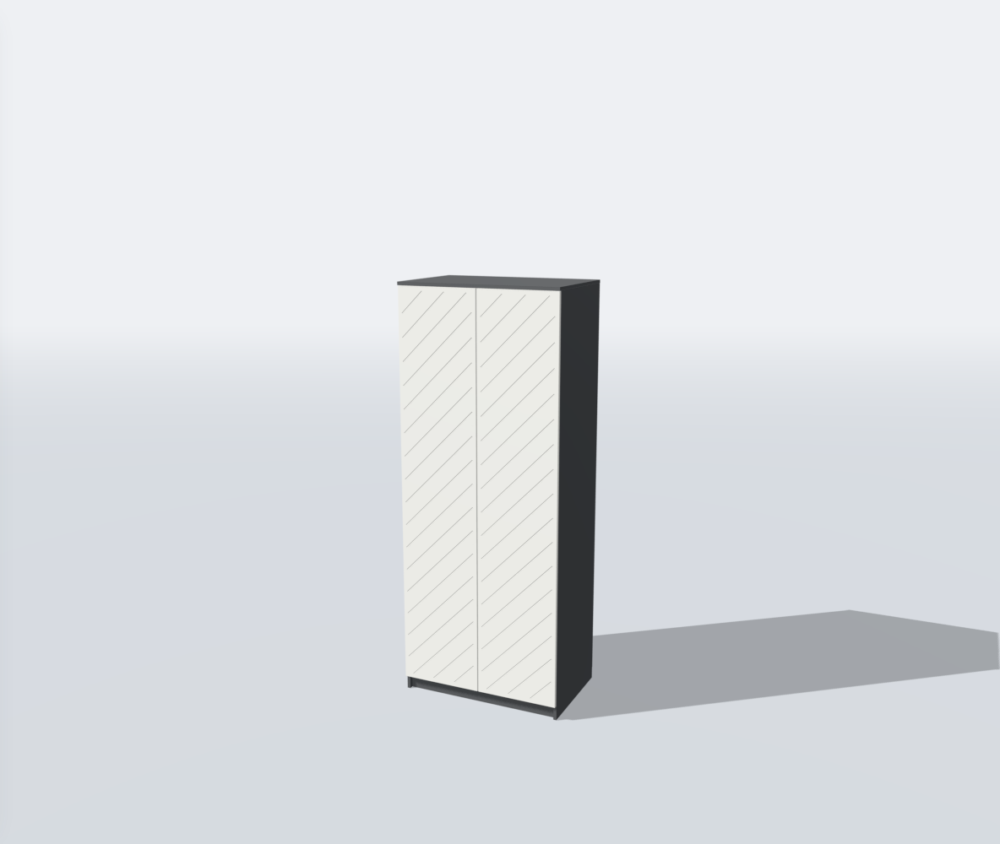
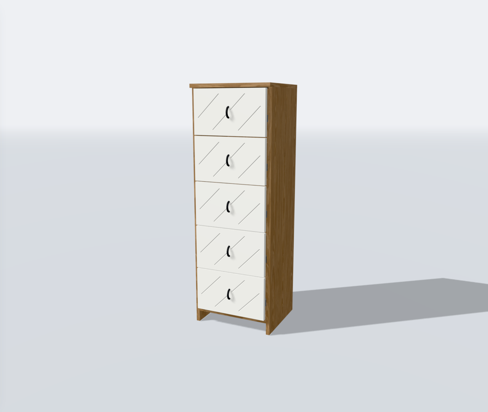

# Проверка диагональных фасадов v1

База — принятый пользователем `facade-antialiasing-v1`, коммит `87a7250`.
Проверена новая геометрия, интеграция девяти моделей и существующие сценарии.

## Автоматические проверки

- `npm run test -- --testTimeout=30000 --maxWorkers=2` — **47 файлов, 414 тестов прошли**.
- `npm run build` — успешно, 122 модуля. Предупреждение о чанке больше 500 kB
  сохраняется; порог не увеличен. `SceneView` — 673,30 kB / gzip 174,87 kB.
- ESLint изменённых TypeScript-файлов — без ошибок.
- Диагональная сетка сохраняет угол, шаг и фазу при изменении ширины с шагом
  1 мм; поля и монтажная полоса не пересекаются с канавками.
- Для фасадов всех моделей проверены min/max и промежуточные асимметричные
  размеры: замкнутая поверхность, согласованное направление граней,
  отсутствие вырожденных треугольников, положительный объём.
- Лучами проверены глубина фрезеровки, монтажная плоскость и метрические UV.
- Общие тесты контроллера проверяют смену всех поддерживаемых рисунков,
  размеры min/base/max, скрытие исходного декора, материалы, открывание и
  освобождение геометрии. Отдельно проверены опоры ручек, включая наклонную
  ручку «Бруклина» и ручку рифлёной двери «Марвэл».
- Новый стиль проходит сохранение и восстановление конфигурации.

Проверка ручки «Бруклина» обнаружила небольшой зазор у прежней фаски 0,7 мм.
Общая фаска сменных фасадов этой модели уменьшена до 0,4 мм. Финальный полный
прогон выполнен после этого исправления.

## Проверка в браузере

Chromium 153 с программным WebGL в Linux. Временные диагностические переменные
добавлялись только плагином проверочного сервера и не входят в приложение.

- На всех девяти моделях выбран реальный элемент «Диагональный», назначен
  белый материал, дождались 16 образцов сглаживания и проверили изображение.
- У «Байкала» проверена минимальная ширина 350 мм и полоса под ручками.
- У «Бруклина» проверены ширина 2000 мм, древесный материал, «Открыть всё»,
  PNG и восстановление диагонального рисунка из ссылки.
- У «Челси» проверены 1000 × 2400 мм, зелёный материал, «Наполнение» /
  «Внешний вид», а также сброс к исходному гладкому фасаду.
- Проверены размеры окна 390 × 844 и 320 × 740 при DPR 1. На 390 px
  горизонтального переполнения страницы нет.
- В 12 неподвижных состояниях после уточнения за следующие 24 кадра
  браузера не выполнялись новые проходы сцены или экранных слоёв.
- Ошибок страницы, HTTP-ошибок и ошибок консоли в этом сценарии нет.
- После изменения фаски «Бруклина» отдельно повторена проверка при ширине
  изделия 1200 мм и окне 390 × 844, DPR 2: белый диагональный рисунок,
  закрытые/открытые ящики, отсутствие переполнения и лишних проходов
  рендера после уточнения. Ошибок нет.

Это проверка поведения и адаптивной вёрстки. Она не измеряет FPS и нагрев
физического ноутбука или телефона. Муар во время движения камеры остаётся
известным ограничением предыдущего этапа; данный рисунок использует принятое
сглаживание после остановки.

## Объём новой геометрии

Сумма треугольников только новых диагональных фасадов, без корпуса,
исходных скрытых деталей и фурнитуры. На каждый фасад создаётся один mesh;
в проверенных размерах меньше 6000 треугольников на одну панель.

| Модель | Min | Base | Max |
| --- | ---: | ---: | ---: |
| 07 — шкаф с центральными ящиками | 12 902 | 13 494 | 16 750 |
| 08 — четырёхдверный шкаф | 10 248 | 12 616 | 13 800 |
| 09 — «Челси» | 5 124 | 5 716 | 6 900 |
| 15 — «Катания» | 11 432 | 11 432 | 16 168 |
| 10 — белый комод | 3 144 | 4 328 | 5 512 |
| 11 — «Норд» | 5 706 | 6 002 | 8 666 |
| 12 — «Бруклин» | 4 716 | 6 492 | 10 044 |
| 13 — «Марвэл» | 5 308 | 7 084 | 10 636 |
| 14 — «Байкал» | 3 190 | 3 190 | 4 670 |

## Примеры

«Челси», белые фасады после уточнения:

«Байкал», минимальная ширина и полоса под ручками:

## Проверка на машине пользователя

После распаковки запустить `node scripts/check-diagonal-facades-v1.cjs`.
Ожидается `DIAGONAL_FACADES_V1_FILES_CONFIRMED`. Проверить новый вариант на
белом и древесном покрытии, изменение размеров, открывание и ссылку/PNG.
Команды тестов, сборки и отдельного коммита находятся в
`docs/updates/diagonal-facades-v1.md`.
