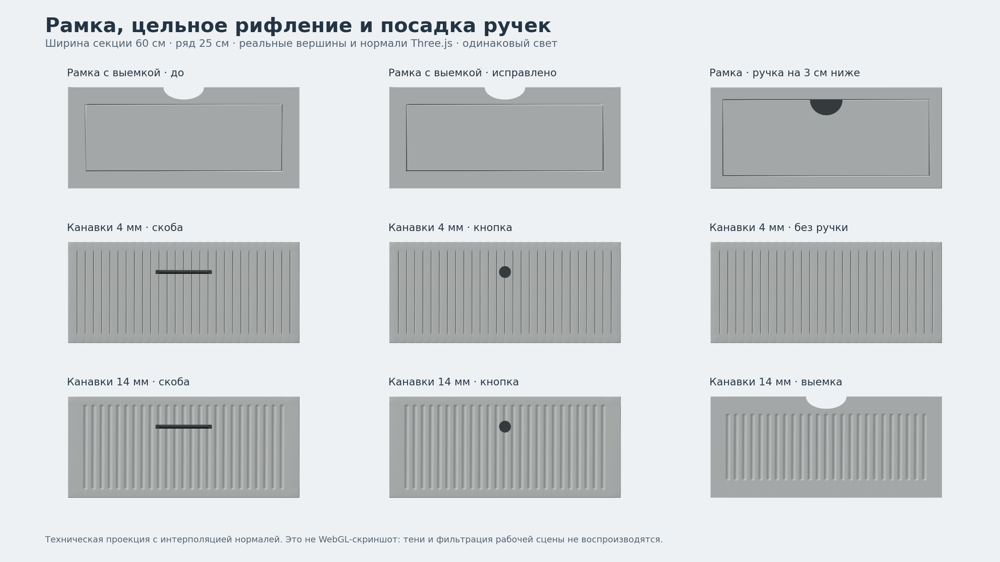

# Рамка, рифление и посадка ручек — drawer-facade-refinement-v1

Исправление поверх установленного `wardrobe-drawer-facades-v1`. Стандарт **v2.33**.

## Рамка с полуовальной выемкой

У рамочной канавки были общие нормали на углах четырёх длинных сторон.
Их усреднение зависело от длины и диагоналей треугольников: по прямой стороне
проходил переход света, похожий на две несовпадающие буквы «П».
Каждый скат теперь имеет отдельные вершины и постоянную нормаль своей плоскости.
Размеры, глубина канавки, толщина панели и сквозная выемка сохраняются.

## Полукруглые накладные ручки

Верхняя прямая сторона полукруглой ручки находится на **30 мм ниже верхнего
края фасада**. Правило действует на ящиках гардеробной и готовых шкафов,
включая шкаф с центральными ящиками. Ручки на дверях остаются на своих местах.
У готовых шкафов учитывается видимая поверхность рамочного фасада при посадке.

## Цельное рифление

У ящиков гардеробной убрана гладкая вертикальная полоса под скобами, кнопками
и планками. Узор не меняется при смене накладной ручки, переходе на верхний
П-профиль или выборе «Без ручек». Одна и та же панель может использоваться
с разной фурнитурой; открытое состояние ящика сохраняется.

Визуальное соединение выполняется со стороны ручки: монтажные корни входят
на 2 мм в поверхность, перекрывая углубления 1,8 мм. Наружный выступ, длина
ручек, положение короба и габариты изделия не увеличиваются. Полукруг,
опущенный на канавку рамки, использует корень 3,2 мм. Болты и сверление здесь
не моделируются; это не производственная схема крепления любой сторонней ручки.

Вырез и верхний захват остаются отдельными формами самой панели. Для выреза
сохранены безопасные поля и открытый полуовал. Рисунок старых GLB каталога
и отдельный вариант «Рифлёные края» не менялись.

## Широкие канавки

В настройках рисунка ящиков гардеробной появилась четвёртая карточка
**«Широкие канавки»**.

| Параметр | Рифлёный | Широкие канавки |
| --- | --- | --- |
| Ширина углубления | 4 мм | 14 мм |
| Шаг между центрами | 20 мм | 20 мм |
| Глубина углубления | 1,8 мм | 1,8 мм |
| Профиль | мягкий | мягкий |

Расширено само углубление — в 3,5 раза. Полоски между канавками становятся
уже. При изменении ширины панели шаг и сечение не растягиваются; крайние
канавки добавляются симметрично. Поддержаны все ручки, оба положения по глубине,
сквозная выемка и укороченный фасад.

Новый ID `fluted-wide` входит в сохранения/ссылки и описание секции. Фильтрация
рельефа получает реальную ширину 14 мм, уточнение неподвижного изображения
включается для обоих видов рифления. Смена накладной ручки переиспользует ту же
геометрию фасада. Новых зависимостей, GLB и текстур нет.

Проекция использует реальные вершины и нормали Three.js, включая предыдущую
рамку для сравнения. Это не WebGL-скриншот: тени и фильтр сцены не воспроизводятся.

## Проверка после установки

1. Выбрать рамочный фасад и полуовальную выемку; осмотреть с двух сторон
   и спереди. Прямая сторона канавки не должна менять направление освещения
   посередине. Попробовать ширину 40/100 см и ряды 20/30 см.
2. Выбрать полукруглую ручку на ящиках гардеробной, затем на ящиках готового
   шкафа. Проверить отступ от верхнего края, контакт и открывание.
3. На рифлёном фасаде переключить скобу → кнопку → полукруг → профиль →
   «Без ручек». Рисунок через центр должен оставаться тем же.
4. Сравнить обычное рифление с широкими канавками. Проверить белый, серый и
   древесный материал, выемку, верхний захват и оба положения фасадов.
5. Изменить размеры с открытым ящиком. Сохранить ссылку, обновить страницу,
   сверить описание и сохранить PNG. На ноутбуке проверить вращение камеры.

Отчёт: [drawer-facade-refinement-v1-validation.md](drawer-facade-refinement-v1-validation.md).
Установка и коммит: `docs/updates/drawer-facade-refinement-v1.md`.
