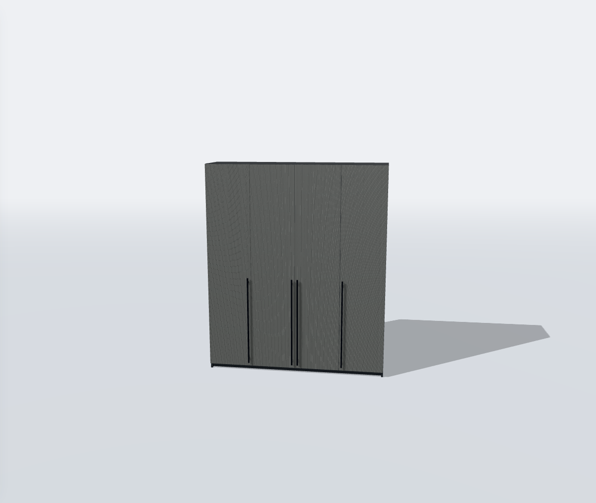
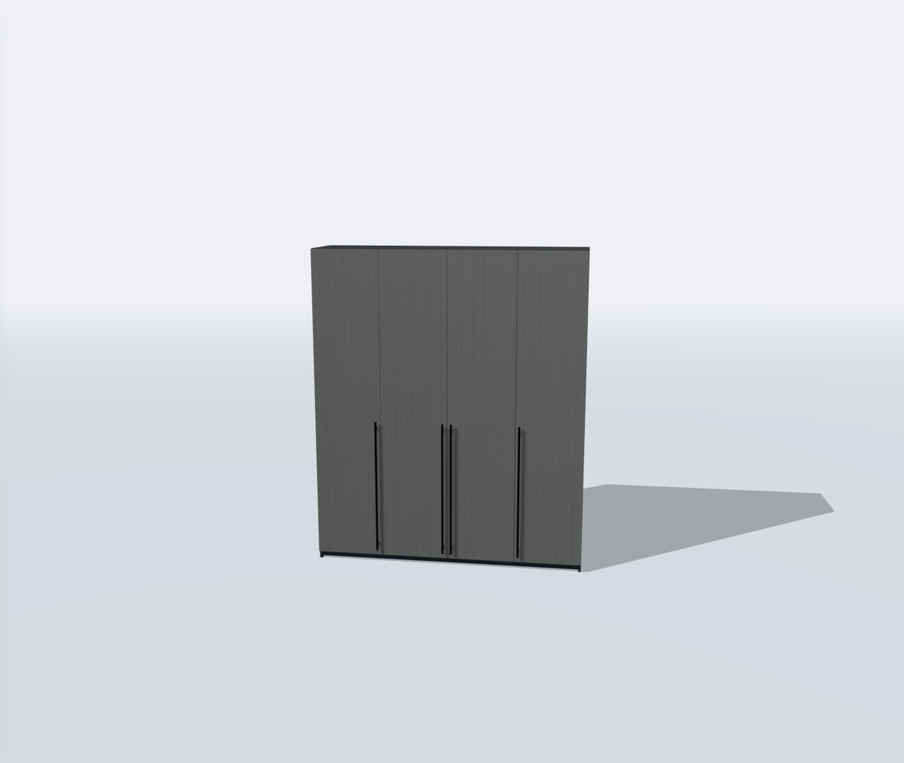

# Проверка facade-antialiasing-v1

Дата: 24 сентября 2026. База: принятый `combined-facades-v1`.

## Автоматические проверки

- `npm run test -- --testTimeout=30000 --maxWorkers=2`: 46 файлов, 407 тестов PASS.
- `npm run build`: PASS. Существующее предупреждение Vite о chunk больше 500 кБ
  остаётся; chunk runtime — 663,76 кБ, gzip 171,02 кБ.
- ESLint изменённых TS/TSX: PASS.
- Новые тесты проверяют остановку/сброс накопления, разные субпиксельные фазы,
  восстановление камеры и состояния renderer, PNG, освобождение буферов,
  отсутствие float attachments и ограничение в 4 миллиона пикселей.

## Проверка в браузере

Chromium 153, программный WebGL в среде разработки. Это проверка поведения и
изображения, не измерение FPS или энергопотребления реального ноутбука/телефона.

Все девять моделей корпусной мебели проверены с белыми «Рифлёными краями»:
шкафы 07, 08, «Челси», «Катания»; комоды 10, «Норд», «Бруклин», «Марвэл», «Байкал».
После 16 образцов в последующие 24 requestAnimationFrame счётчики проходов сцены
и полноэкранного сглаживания не меняются. Проверены также:

- Открывание всех ящиков «Бруклина», изменение ширины открытой модели,
  асинхронная смена белого покрытия на дуб.
- Переходы между рамочным, гладким, рифлёным и комбинированным фасадом.
  Повторные два цикла дают те же 926 GPU-геометрий и 9 текстур в этом сценарии.
- Изменение камеры сбрасывает накопление, но не пересчитывает карту теней.
- Экспорт PNG после уточнения; файл открыт и проверен визуально.
- Исходное мелкое рифление «Катании» в дальнем ракурсе и режим «Наполнение».
- Мобильные области просмотра шириной 390/320 CSS-пикселей при DPR 1 и 2,
  открывание кнопкой интерфейса. Горизонтального переполнения страницы нет
  в проверке DPR 1; изображения DPR 2 также открыты и осмотрены.
- Возврат из корпусной мебели в конструктор стола, изменение длины и покрытия,
  переход к готовому столу и обратно: сцена обновляется и останавливается.
- Восстановление конфигурации по ссылке. Ошибок JavaScript/HTTP/шейдеров
  в завершённых сценариях не обнаружено.

Искусственный сброс WebGL отдельно подтвердил, что новые буферы пересоздаются
и накопление возобновляется. Это не проверка полного восстановления сцены:
сгенерированное на GPU освещение окружения после такого сброса не восстанавливается
полностью; для него требуется перезагрузка страницы. Полное восстановление
окружения не входит в данное обновление.

## Сравнение

Одна модель, камера, размеры, материал и освещение. Первым — обычный
кадр, вторым — результат 16 образцов. Исходная геометрия не менялась.

### Обычный кадр

### После уточнения

В проверяемом ракурсе выраженные волнистые полосы исчезли. Это не гарантия
отсутствия муара на любом расстоянии: во время непрерывного движения используется
обычный рендер, а детали меньше пикселя требуют усреднения. До/после на участке
фона 200×200 пикселей максимальная и средняя разница RGB — 0.

## Что проверить на реальном устройстве

Открыть «Катанию» и белый комод с рифлением, приблизить/отдалить и остановиться;
дождаться уточнения, затем открыть дверь/ящик и сменить материал. Проверить
отзывчивость и длительность уточнения на своём ноутбуке и телефоне. Аппаратные
FPS, температура и расход батареи в этой среде не измерялись.
