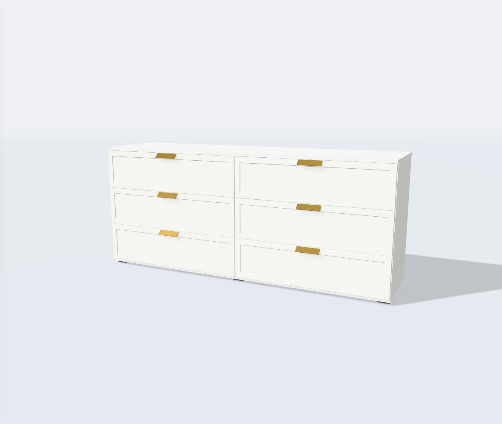
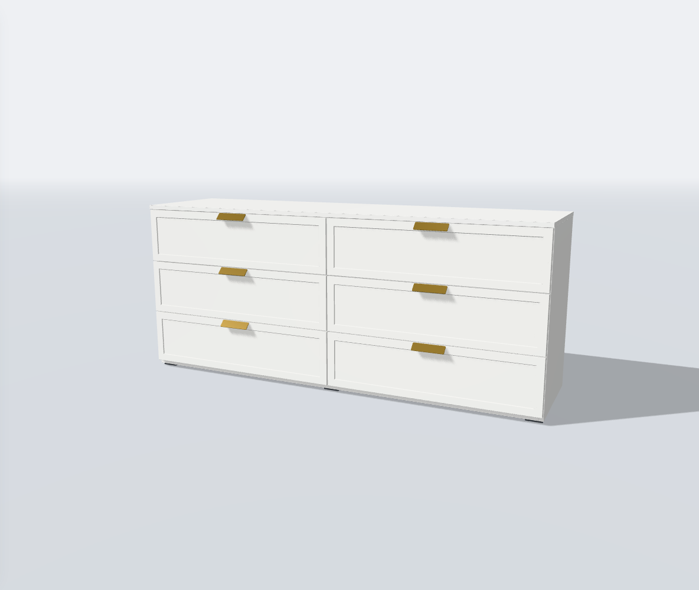
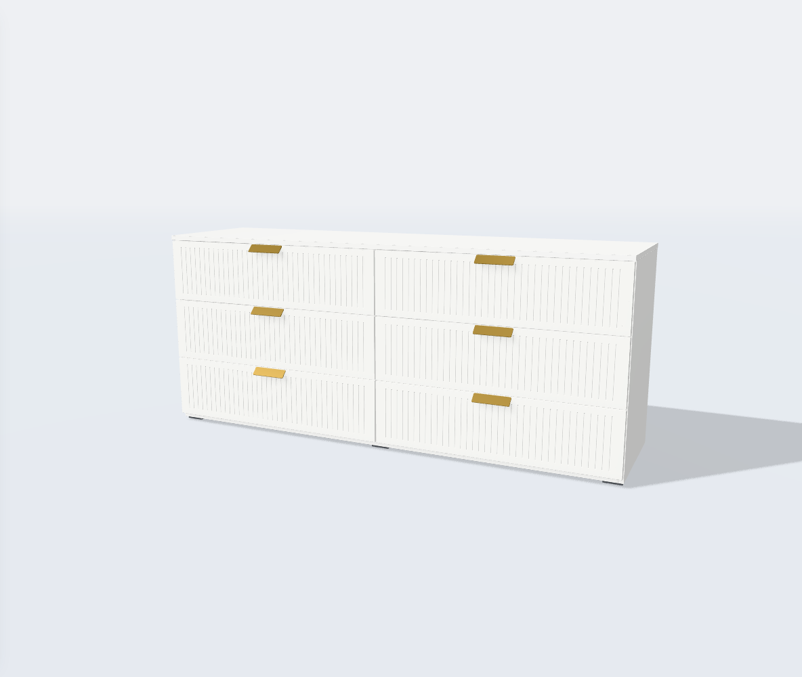
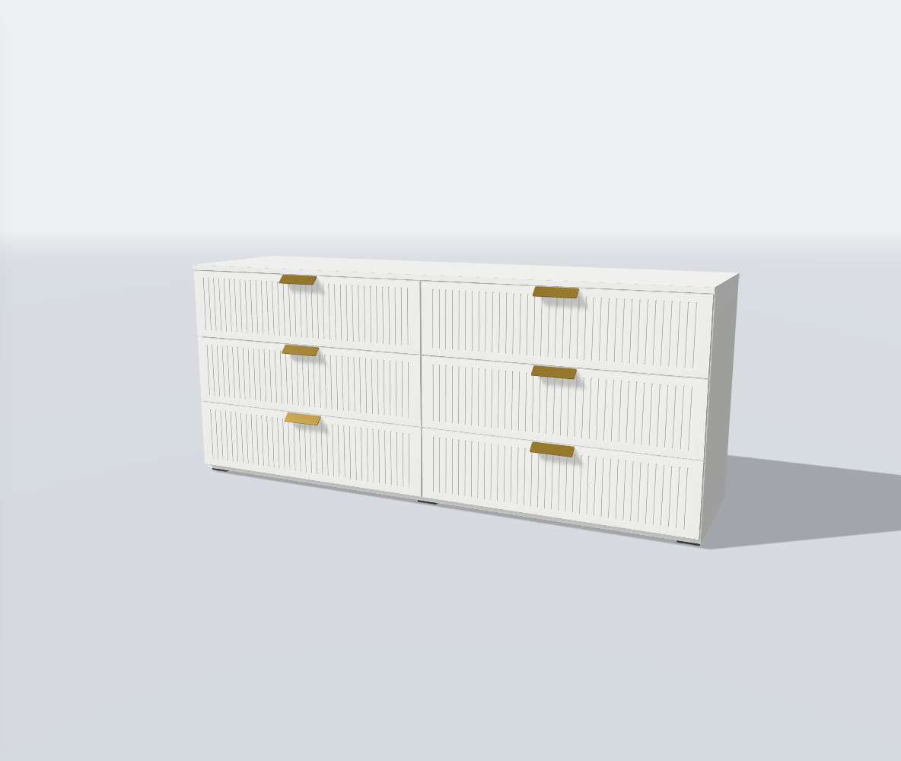

# Свет для белых фасадов — facade-lighting-v1

Дата: 22 сентября 2026 года. Основа: принятый `cabinet-views-facades-v2`.

## Причина и результат

На белых покрытиях плоскость фасада и его освещённые скосы попадали в яркую
область тонального преобразования, где разница между ними сжимается.
Общий свет дополнительно ослаблял тени, а normalBias 8 мм и широкий фильтр
ухудшали мелкие тени под ручками и в стыках.

Изменён общий студийный свет в `createSceneEnvironment.ts`. На одинаковом
ракурсе белые рамки и канавки различимы лучше; тени под фурнитурой стали
выразительнее. Новая настройка действует также на исходные фасады из GLB,
на корпус, наполнение и столы.

| Параметр | Было | Стало |
| --- | --- | --- |
| Окружение | 0.45 | 0.32 |
| Заполняющий свет | 0.3 | 0.2 |
| Основной свет | 2.7 | 2.6 |
| Положение основного света | −3, 4.5, 3 | −3.8, 4.5, 3 |
| Контровой свет | 0.8 | 0.6 |
| PCF radius | 4 | 2 |
| Shadow normalBias | 8 мм | 2 мм |

Цвета, PBR-текстуры, roughness/metalness и геометрия профилей прежние.
Камеры, физические размеры, открывание, сохранённые сборки и ссылки не менялись.
Стандарт ассетов остаётся **v2.10**: новый контракт моделей не требуется.

## Стоимость и пределы

Одна карта теней 2048² и одна карта окружения 256, прежнее число источников
света и проходов рендера. Новых зависимостей, текстур и экранного AO нет.
Экспозиция 1 и NeutralToneMapping сохраняются. При том же материале итоговый
цвет в сцене закономерно выглядит иначе из-за нового освещения.

Рельеф остаётся физическим и зависит от ракурса и направления света.
Канавки 1.5 мм не должны выглядеть одинаково тёмными со всех сторон.
Очень частое исходное рифление «Катании» вдали всё ещё может давать муар;
это отдельная задача фильтрации мелкого рисунка, не исправление этого этапа.

## Сравнение

Одинаковые модель, материал, габариты и камера; отличается только свет.

| Белый «Бруклин» | До | После |
| --- | --- | --- |
| Рамочный |  |  |
| Рифлёный |  |  |

## Проверка на стороне пользователя

1. Белый «Бруклин»: рамочный и рифлёный варианты, обычный и близкий ракурс.
2. «Байкал»: белые фасады на деревянном корпусе; затем тёмный материал.
3. «Челси»/«Катания»: белый фасад, открытые двери и наполнение.
4. «Марвэл»: исходное рифление и рамочный вариант в зелёном покрытии.
5. Любой стол: дерево/камень. Сохранить нужный вид в PNG.

Подробности автоматической и браузерной проверки — в соседнем отчёте
`facade-lighting-v1-validation.md`.
