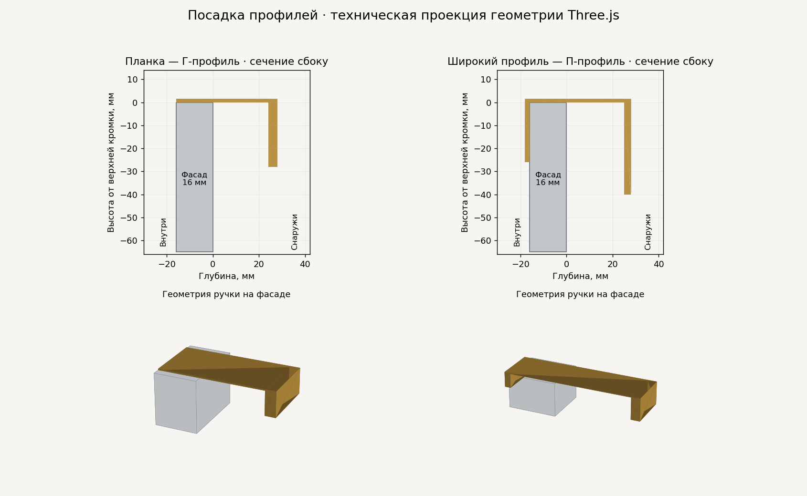

# Посадка ручек и близкий осмотр — furniture-handles-fit-v1

> Историческое описание v2.30. Актуальные размеры планки и ограничения
> камеры уточнены в [handle-plank-camera-v1](handle-plank-camera-v1.md).

Исправление поверх `furniture-handles-v2`, стандарт **v2.30**.
GLB, зависимости, формат сессий и ссылок не меняются. Существующий выбор ручек
сохраняется; их обновлённая геометрия появляется после установки.

## Что изменено

| Вариант | Ящики | Двери готовых шкафов |
| --- | --- | --- |
| Выемка | Полуовал 100 × 30 мм, только гардеробная | Не предлагается |
| Круглая кнопка | Прежний диаметр 28 мм | Диаметр 49 мм, ось в 50 мм от края |
| Полукруглая металлическая | Прежние 78 × 37 мм | 136,5 × 64,75 мм, прямой край в 20 мм от края двери |
| Планка | Длина 110 мм, Г-сечение | Длина 170 мм, вертикально у свободного края |
| Широкий профиль | Длина 220 мм, П-сечение | Длина 330 мм, вертикально у свободного края |

Размеры кнопки/полукруга на дверях увеличены в лицевой плоскости в 1,75 раза,
выступ от фасада сохранён 20 мм. Кнопка садится основанием на фактическую
поверхность, включая углублённое поле рамочного фасада. Параметры остальных
ручек не изменены. Меню и описание конфигурации показывают дверные 17/33 см
отдельно от ящичных 11/22 см.

Профиль охватывает кромку: внутренняя монтажная ножка за фасадом, наружная
губа перед ним. Планка имеет верхнюю монтажную полку и более толстый наружный
крючок; внутренней вертикальной ножки у неё нет. Болты не добавляются.
Оба профиля выступают перед фасадом на 28 мм; за наружной губой остаётся
25/24 мм соответственно. Внутренняя ножка П-профиля толщиной 2 мм и высотой
26 мм; наружная губа — 3 × 40 мм. У Г-планки наружная губа — 4 × 28 мм.

Верхняя перемычка толщиной 1,5 мм лежит на кромке и помещается в существующий
2-миллиметровый зазор. Учитываются фасады 16/18 мм. В режиме утопления на
29 мм ручки остаются внутри глубины корпуса; у ящиков вровень интерфейс
учитывает новый выступ 28 мм в полном габарите.

Изображение построено по треугольникам фактической геометрии. Это техническая
проекция, не снимок WebGL-сцены и не проверка освещения на устройстве.

## Близкий осмотр гардеробной

- Минимальный радиус вращения/приближения — 35 см вместо 120 см.
- Колесо приближает в направлении курсора. Наведите его на нужную ручку.
- Правая кнопка мыши перемещает вид по экрану, в том числе вверх/вниз;
  на сенсорном экране используются жесты двумя пальцами.
- «Показать всю сборку» возвращает полный вид текущей сборки.
- При переходе к готовым моделям возвращаются их прежние настройки навигации.
  Ракурс гардеробной запоминается отдельно.

Радиус измеряется до точки вращения, не от поверхности изделия. Камера не
имеет системы столкновений с мебелью. Начальная постановка и сопоставимость
размеров готовых шкафов сохраняются.

## Проверка в браузере после установки

1. На ящиках гардеробной выбрать выемку, планку и профиль; посмотреть спереди,
   сбоку и изнутри открытого ящика. Проверить оба положения фасадов и верхний
   ящик под крышкой блока. Выемка должна быть широкой, монтаж П-профиля —
   с внутренней стороны, наружная губа обоих профилей доступна снизу.
2. Открыть все четыре готовых шкафа. Проверить кнопки/полукруги и размеры
   планки/профиля 17/33 см на дверях. У шкафа с центральными ящиками проверить,
   что ящики сохраняют меньшие ручки 11/22 см. Проверить рамочный фасад.
3. Поменять ручку на открытом ящике/двери, материал, размеры; вернуться к
   исходным ручкам. Проверить режим наполнения, сохранённую ссылку и PNG.
4. Приблизить курсором крайний и центральный ящики длинной гардеробной,
   переместить вид вертикально, вернуться к полному виду. Переключить каталог
   и гардеробную, убедиться, что ракурсы и управление восстанавливаются.

Изображения вариантов ручек и перегруппировка интерфейса будут отдельным
этапом и отдельным коммитом, чтобы этот этап можно было легко откатить.
