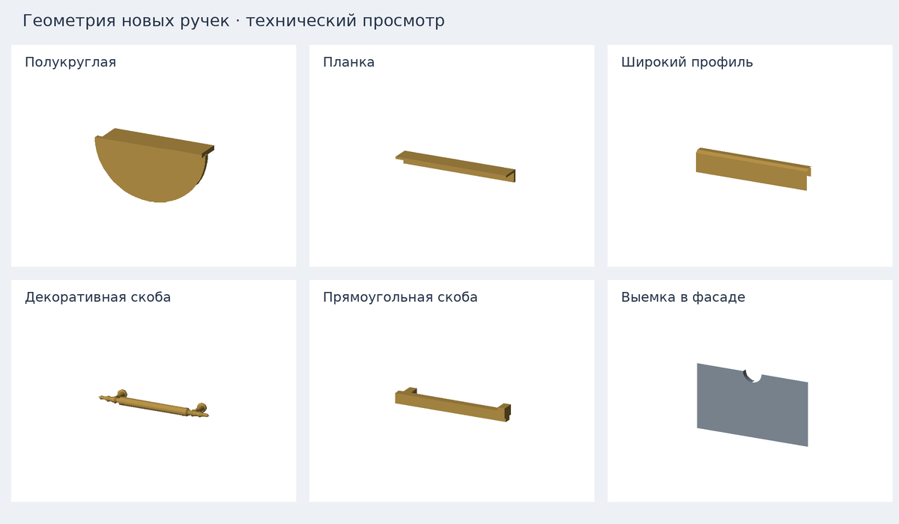

# Ручки и захваты фасадов — furniture-handles-v2

Поверх принятого `wardrobe-drawer-handles-v1`. Стандарт v2.29.

> Размеры профилей и выемки уточнены следующим исправлением
> [furniture-handles-fit-v1](furniture-handles-fit-v1.md), стандарт v2.30.
> Ниже сохранено описание исходного этапа v2.29.

## Что доступно

- Прямая гардеробная: максимум **7 секций**, во всех путях добавления и загрузки.
  Будущий предел для Г-/П-сборок — **21 суммарно**, сейчас такие сборки не включены.
- Ящики гардеробной: прежние скоба, кнопка, без ручек, а также пять накладных
  форм по референсам, захват сверху и полукруглая выемка.
- Готовые шкафы «Челси», «Катания», четырёхдверный и с центральными ящиками:
  выбор ручек. Двери и ящики настраиваются отдельно; у дверей вертикальная
  установка, у ящиков горизонтальная. Добавлена сатиновая латунь во все четыре
  палитры фурнитуры. «Исходные ручки модели» восстанавливает исходный вид,
  включая модели, где ручек раньше не было.
- Захват сверху и выемка в этом этапе доступны именно ящикам гардеробной.
  Готовым шкафам добавлены накладные ручки. Их внутренние планки ящиков требуют
  отдельной адаптации перед вырезами, чтобы не перекрывать захват.

## Геометрия

| Вариант | Размер прототипа | Выступ от фасада |
| --- | --- | --- |
| Полукруглая | 78 × 37 мм | 20 мм |
| Планка | длина 110 мм | 17,5 мм |
| Широкий профиль | 220 × 40 мм | 18 мм |
| Декоративная скоба | длина 178 мм, крепления 128 мм | 33 мм |
| Прямоугольная скоба | длина 160 мм | 28 мм |
| Длинная скоба готового шкафа | дверь 600 мм, ящик 320 мм | 28 мм |
| Захват сверху | 40 мм до крышки блока | 0 |
| Полукруглая выемка | ширина 60 мм, глубина 30 мм | 0 |

Длинная скоба ограничена размером конкретного фасада с полями 20 мм. Остальные
размеры не растягиваются. Геометрия разработана по присланным фотографиям и
схемам; это варианты для конфигуратора, не паспорта конкретных артикулов.
Декоративная скоба передаёт форму стержня, фигурных концов и опор; мелкая
продольная насечка не построена отдельными деталями.

Это проекция реальных треугольников новой геометрии, а не скриншот WebGL-сцены.

При захвате сверху фасад короче на 38 мм: с прежними 2 мм зазора сверху
получаются 40 мм до крышки блока. Между фасадами соседних ящиков — 42 мм.
Стенки короба ниже на 22 мм относительно обычных, чтобы не перекрывать захват.
Дно, направляющие, высота ряда и положение блока остаются прежними.
Полезная высота короба — высота ряда минус 66 мм; у остальных вариантов
минус 44 мм. Интерфейс показывает выбранное значение.

Выемка сквозная на всю толщину фасада 16 мм. За ней нет внутренней фронтальной
планки: есть свободное место под пальцы. Вырез получает покрытие фасада.
Металлическое покрытие при отсутствии накладной ручки относится к направляющим.

Декоративная скоба выступает на 4 мм за корпус даже в утопленном варианте
(33 − 29 мм). Это отражено в подписи и полном габарите гардеробной.

## Сохранение и ресурсы

Старые сборки с отсутствующим `drawers.handle` по-прежнему используют скобу.
Сессии/ссылки гардеробной остаются v4. Новое поле `models[id].handles` содержит
независимые `doors` и `drawers`; отсутствие поля равно исходному виду.
Неизвестные значения отбрасываются нормализатором, неподдерживаемые группы
не применяются. Смена размеров/материала сохраняет выбор, сброс возвращает
исходные ручки. Открывание, скрытие дверей и PNG используют ту же сцену.

На одну новую накладную ручку приходится один mesh; одинаковые формы делят
геометрию. Геометрия создаётся при изменениях конфигурации, а не каждый кадр.
Неиспользуемая геометрия освобождается. Генераторы каталогов сохраняют метаданные
ручек и разрешение латуни; GLB и новые зависимости в пакет не входят.

## Проверка после установки

1. Добавить 7 секций. Восьмая недоступна; изменение размеров, перестановка и
   удаление работают. «Показать всю сборку» вмещает ряд после увеличения ширины.
2. В гардеробной выбрать каждый вариант ручек, включая оба захвата, для
   утопленных и вровень ящиков. Проверить виды спереди/сбоку и открывание.
3. У верхнего захвата посмотреть в щель: короб ниже, сверху есть место для
   руки. У выемки через центральный вырез видно внутреннюю часть ящика.
4. Сменить ручку у открытого ящика, затем ширину, глубину и высоту ряда.
   Поза сохраняется, старые детали ручек не остаются. Полезная высота обновляется.
5. В готовых шкафах открыть раздел «Ручки». Проверить полукруги на паре дверей,
   профили, обычную и длинную скобы, а также исходный вариант и без ручек.
   У шкафа с центральными ящиками задать разные ручки дверям и ящикам.
6. Проверить латунь, белый/чёрный металл, смену рисунка фасада, режим «Наполнение».
   Ручки уходят вместе с дверями и движутся вместе со своими ящиками.
7. Перезагрузить страницу, открыть ссылку, проверить описание и PNG. Сброс
   готового шкафа возвращает исходные ручки, старые ссылки открываются как прежде.

Реальный браузер, экспорт PNG и скорость на ноутбуке/телефоне проверяются
на устройстве пользователя; программные результаты — в отчёте валидации.
