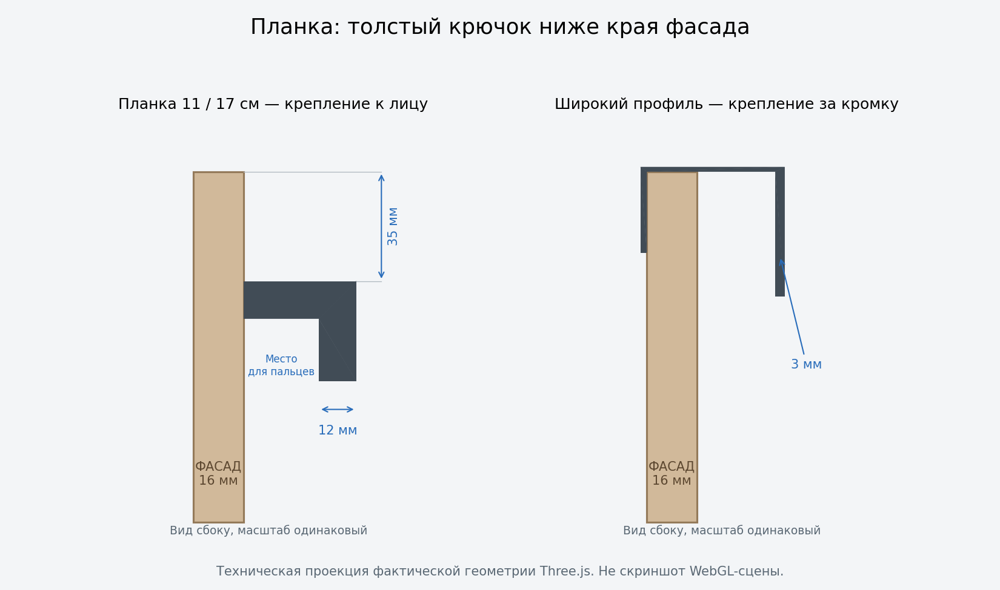

# Лицевая планка и ограничитель камеры — handle-plank-camera-v1

Исправление поверх принятого `furniture-handles-fit-v1`. Стандарт **v2.31**.

## Планки 11 и 17 см

По Blender-референсу пользователя планка крепится к лицевой поверхности.
Она не обхватывает верх фасада. Длины прежние: 110 мм на ящиках,
170 мм на дверях готовых шкафов. ID `edge-pull` сохранён; существующие
конфигурации автоматически получают исправленную форму.

| Параметр | Значение |
| --- | --- |
| Толщина корня и наружной стенки | 12 мм, в 4 раза больше наружной стенки широкого профиля |
| Выступ от поверхности крепления | 36 мм |
| Высота сечения | 32 мм |
| Пространство для пальцев под корнем | 24 мм в глубину × 20 мм по высоте |
| Верх планки на ящиках | 35 мм ниже верхнего края фасада |
| Отступ свободного края корня на дверях | 20 мм от края створки |

В каталоге корень садится на видимую поверхность в точке крепления, включая
углублённое поле рамочного фасада. Это прототип геометрии ручки; болты и
производственное сверление не моделируются. На сложном рельефе плоское
основание не повторяет каждую канавку.

В гардеробной выступ входит в полный габарит: при утоплении фасада на 29 мм
планка выступает за секцию на 7 мм. Короба, зазоры, открытия и материалы
сохраняются. Широкий П-профиль, кнопки, полукруглые ручки и выемки не менялись.

## Приближение камеры гардеробной

Радиус OrbitControls теперь от 65 см, но это лишь расстояние до цели вращения.
Чтобы не попадать внутрь, отдельная проверка удерживает камеру вне объёмов
каждой секции и каждого выдвинутого ящика. Пустая внутренность ящика также
считается занятой: камера не проходит между его стенками.

Отступ от этих объёмов — минимум 20 см. При очень широкой ближней плоскости
камеры он увеличивается, чтобы её углы не обрезали мебель. Проверяется весь
путь от предыдущего положения: резкое колесо/панорамирование не перепрыгивает
через корпус. Если ящик выдвигается к камере, она отступает наружу. Направление
взгляда сохраняется. При остановке дополнительных GPU-проходов не появляется.

Приближение к курсору, вертикальное панорамирование, сохранение ракурса и
«Показать всю сборку» остаются. Настройки готовых шкафов/комодов/столов не
меняются. Ограничитель использует простые прямоугольные объёмы, поэтому рядом
с углом остановка может происходить немного раньше, чем у отдельной стенки.

## Проверка после установки

1. В гардеробной выбрать «Планка 11 см», посмотреть сбоку и снизу. Планка
   толстая, ниже верхнего края; корень касается лицевой плоскости.
2. Сравнить с широким профилем: он тонкий и обхватывает верхнюю кромку.
3. На шкафах выбрать планки для дверей, у шкафа с центральными ящиками —
   также для ящиков. Проверить гладкий и рамочный рисунки, открывание,
   минимальные и максимальные размеры. Дверные планки остаются вертикальными.
4. В гардеробной приблизиться к ручке, затем сильнее покрутить колесо;
   попробовать сбоку и сверху. Камера останавливается перед мебелью.
5. Открыть ящики рядом с камерой; попробовать приблизиться к пустой внутренности.
   Проверить и утопленные, и расположенные вровень ящики, глубины 40/80 см.
6. Переместить вид правой кнопкой, нажать «Показать всю сборку», переключиться
   в каталог и обратно. На телефоне проверить жесты двумя пальцами.
7. Сохранить PNG с планкой и открытым ящиком. Сохранения и ссылки используют
   прежние версии схем данных.

Программные результаты — в `handle-plank-camera-v1-validation.md`.
Команды проверки и коммита — в `docs/updates/handle-plank-camera-v1.md`.
Предпросмотры ручек в интерфейсе и его перегруппировка остаются отдельным шагом.
