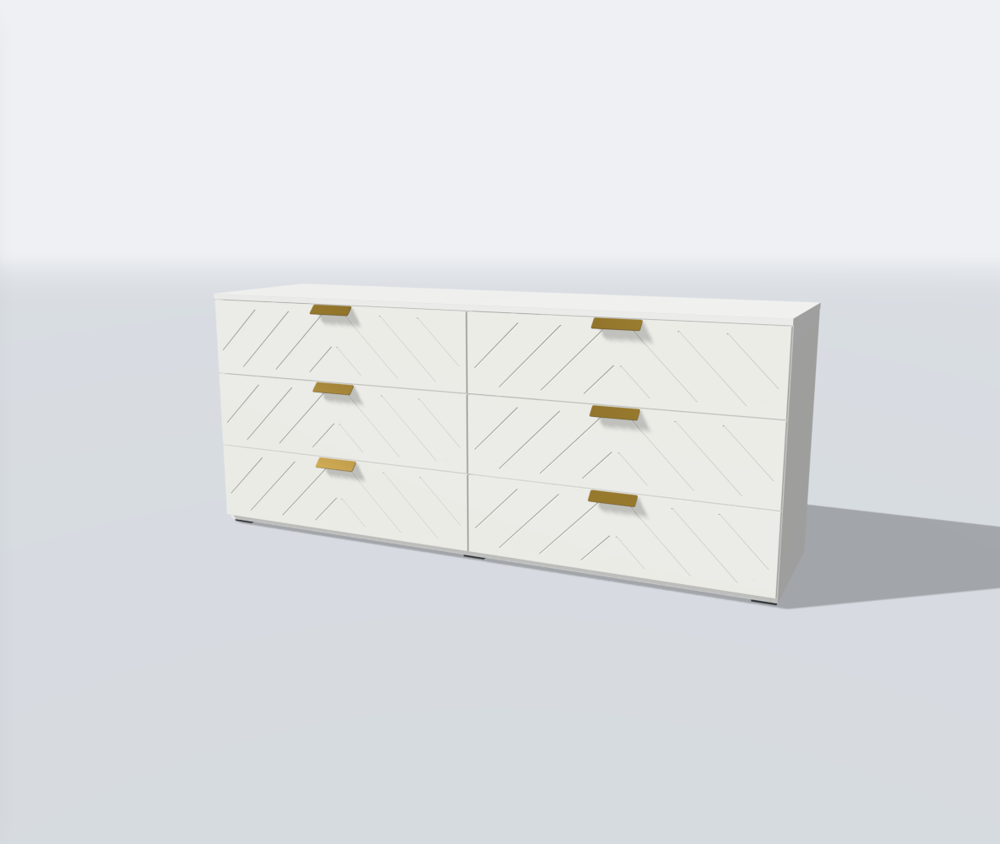
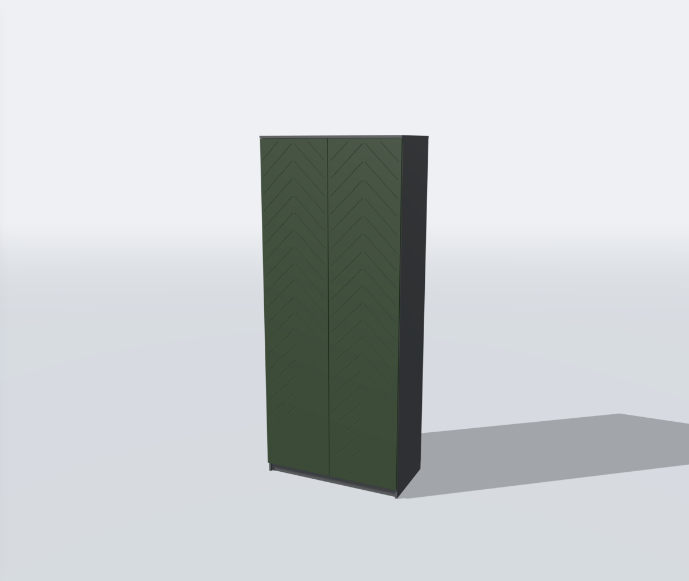

# Проверка фасадов «Ёлочка» v1

База — принятый `diagonal-facades-v1`, коммит пользователя `ee6d581`.

## Автоматические проверки

- `npm run test -- --testTimeout=30000 --maxWorkers=2` — **48 файлов, 419 тестов прошли**.
- `npm run build` — успешно. `SceneView`: 673,98 kB / gzip 175,04 kB.
  Прежнее предупреждение Vite о чанке больше 500 kB сохраняется; порог не изменён.
- ESLint всех 23 изменённых TypeScript-файлов — без ошибок.
- Проверены симметричные пары, шаг и фаза на каждом миллиметре ширины
  294–1000 мм, безопасные поля, полоса 12 мм и более широкое монтажное поле.
- Проверены глубина выемок с обеих сторон, плоская середина и метрические UV.
- Геометрия всех девяти моделей проверена на предельных и асимметричных
  габаритах: замкнутость, согласованный обход, отсутствие вырожденных
  треугольников и положительный объём.
- Общие тесты контроллера включают новый стиль: размеры min/base/max,
  сохранение сборок и монтажных плоскостей, открывание, смена материалов,
  освобождение геометрии. Опоры ручек проверяются отдельными лучами.
- Сохранения и ссылки поддерживают новый ID; прежние значения по умолчанию
  и обработка старых конфигураций проверены общими тестами.

При выделении общего построителя дополнительно сравнены диагональные фасады
с принятой копией предыдущего этапа: **129 панелей/размеров**. Массивы позиций,
нормалей, UV и индексов совпадают точно. Это сравнение выполнено отдельным
временным скриптом, не привязанным к новым функциям построителя.

## Браузер

Chromium 153, Linux, программный WebGL. Проверочные переменные внедрялись
только временным плагином сервера; они не входят в поставку.

- На всех девяти моделях выбран реальный элемент «Ёлочка», назначены белые
  фасады; проверены кадры после 16 образцов сглаживания.
- У «Байкала» проверена ширина 350 мм и зона под ручками.
- У «Бруклина» проверены ширина 2000 мм, древесный материал, открывание
  всех ящиков, PNG и восстановление рисунка по ссылке.
- У «Челси» проверены 1000 × 2400 мм, зелёное покрытие, наполнение /
  внешний вид, сброс к исходному гладкому фасаду.
- Проверены окна 390 × 844 и 320 × 740, DPR 1. На ширине 390 px
  горизонтального переполнения страницы нет; карточка рисунка доступна.
- В 12 неподвижных состояниях после уточнения не было новых GPU-проходов
  сцены или экранных слоёв за следующие 24 кадра браузера.
- Ошибок страницы, HTTP-загрузок и консоли в этом сценарии нет.

Это проверка функций и адаптивной вёрстки, а не замер скорости/нагрева
физического телефона. Муар в движении остаётся известным ограничением.
Рельеф правого и левого направления освещается по-разному при одном боковом
источнике света; цвет покрытия не затемняется искусственно для усиления линий.

## Бюджет геометрии

Треугольники только новых фасадов, без корпуса, скрытого исходного декора
и фурнитуры. Один mesh на панель. Все проверенные панели укладываются
в лимит 10 000 треугольников; суммарно — до 29 784 при максимальной «Катании».

| Модель | Min | Base | Max |
| --- | ---: | ---: | ---: |
| 07 — шкаф с центральными ящиками | 20 450 | 22 226 | 26 666 |
| 08 — четырёхдверный шкаф | 19 128 | 23 864 | 25 048 |
| 09 — «Челси» | 9 564 | 10 748 | 12 524 |
| 15 — «Катания» | 20 312 | 20 312 | 29 784 |
| 10 — белый комод | 3 736 | 4 920 | 6 104 |
| 11 — «Норд» | 7 038 | 7 630 | 10 590 |
| 12 — «Бруклин» | 5 604 | 7 380 | 10 932 |
| 13 — «Марвэл» | 7 380 | 9 748 | 13 892 |
| 14 — «Байкал» | 3 190 | 3 190 | 4 670 |

## Примеры

Белый «Бруклин»:

Увеличенный «Челси» с зелёными фасадами:

## Приёмка обновления

Архив накладывается на принятую базу. Проверка файлов:
`node scripts/check-herringbone-facades-v1.cjs`, ожидаемый маркер —
`HERRINGBONE_FACADES_V1_FILES_CONFIRMED`.

На машине пользователя проверить «Ёлочку» на белом и древесном покрытии,
минимальные/максимальные размеры, ручки, открывание, PNG и ссылку.
Команды отдельного коммита — `docs/updates/herringbone-facades-v1.md`.
