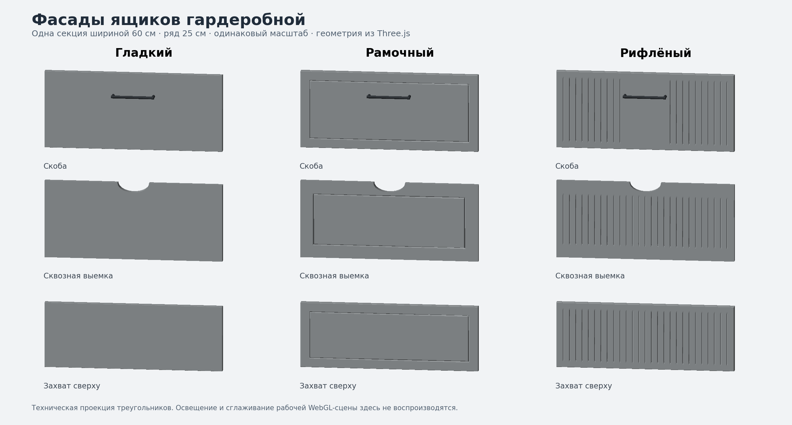

# Фасады ящиков гардеробной — wardrobe-drawer-facades-v1

Этап поверх принятого `handle-plank-camera-v1`. Стандарт **v2.32**.

В настройках блока ящиков выбранной секции добавлены три карточки: гладкий,
рамочный и рифлёный фасады. Выбор применяется ко всем ящикам этой секции;
соседние секции можно оформить иначе. Рисунок сохраняется в сессии браузера,
ссылке и текстовом описании сборки. Покрытие фасада — материал корпуса секции.

Это проекция действительных треугольников Three.js, не скриншот рабочей сцены.
Она показывает форму, вырез и места креплений. Свет и сглаживание отличаются.

## Размеры рисунка

| Параметр | Значение |
| --- | --- |
| Толщина панели | 16 мм |
| Ширина рамки | 28 мм; с выемкой — 40 мм |
| Глубина рамочной канавки | 3 мм; скаты по 2 мм |
| Шаг / ширина / глубина рифления | 20 / 4 / 1,8 мм |
| Боковые поля рифления | минимум 20 мм |
| Верхнее и нижнее поле рифления | 18 мм; с выемкой — 40 мм |
| Плавный выход канавок | 6 мм |
| Выемка | полуовал 100 × 30 мм, сквозной |

Рамочный вариант здесь имеет плоское центральное поле на уровне наружной
поверхности: его отделяет углублённая канавка. Такой профиль сохраняет
контакт всех принятых ручек с фасадом. Это отличается от утопленного поля
рамочных фасадов готовых моделей каталога.

У рифления под накладные ручки оставлена гладкая центральная полоса по ширине
их креплений. П-профиль и полукруглая ручка используют гладкое верхнее поле.
При смене ширины шаг канавок не растягивается; добавляются или убираются
крайние канавки. Укороченный фасад сохраняет зазор для верхнего захвата.
Вокруг полуовального выреза остаётся цельный материал, декоративной заглушки нет.

Смена рисунка не меняет размеры короба, утопление, ход, высоты полок и штанги.
Ящики остаются открытыми, если были выдвинуты. Ограничитель камеры предыдущего
этапа продолжает учитывать их фактические габариты.

## Совместимость и ресурсы

Добавлено только необязательное `drawers.facadeStyle` (`smooth | frame | fluted`).
Без него используется прежняя гладкая геометрия. Старые сессии и ссылки не
требуют миграции; неизвестный рисунок сбрасывается нормализатором с сообщением.
Новых зависимостей, моделей GLB или текстур нет.

Одинаковые панели используют одну геометрию. На рифлёных панелях подключён
существующий фильтр мелкого рельефа и теней, а для неподвижной сцены — уточнение
изображения. Фильтр не заполняет выемку и не меняет внешние границы фасада.
Геометрия пересчитывается при изменении размеров/рисунка, не при вращении камеры.
Полное отсутствие муара при любом ракурсе не гарантируется.

## Проверка после установки

1. Создать две секции с ящиками, выбрать разные рисунки. Проверить, что меняется
   только выбранная секция, затем переставить секции местами.
2. Переключить рисунок на выдвинутых ящиках; изменить ширину и высоту ряда.
   Короба и ручки должны оставаться соединёнными с фасадами.
3. Проверить скобу, кнопку, толстую планку 11 см, П-профиль, полукруг и выемку.
   Осмотреть сбоку контакт креплений, выемку сверху и захват укороченного фасада.
4. Проверить оба положения ящиков: утопленные и вровень. Минимальную ширину
   40 см и максимальную 100 см, ряды 20 и 30 см, глубины 40 и 80 см.
5. Сравнить серый, белый и древесный материалы, приблизить/отдалить камеру,
   остановить вращение. На слабом устройстве проверить также семь секций.
6. Сохранить PNG, скопировать описание и ссылку, открыть её в другой вкладке.
   Обновить страницу: рисунки должны восстановиться. Проверить старую ссылку.

Программные результаты: [отчёт](wardrobe-drawer-facades-v1-validation.md).
Команды установки и отдельного коммита: `docs/updates/wardrobe-drawer-facades-v1.md`.
Следующий функциональный этап — общие двери секций с проверкой совместимости
с ящиками и ручками. Предпросмотры ручек и перегруппировка интерфейса — отдельно.
