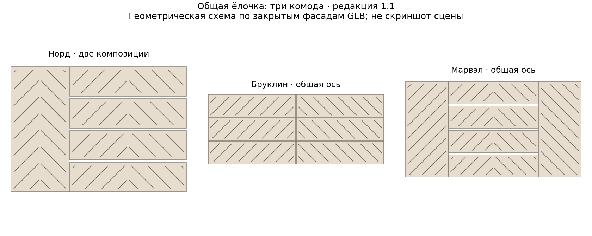
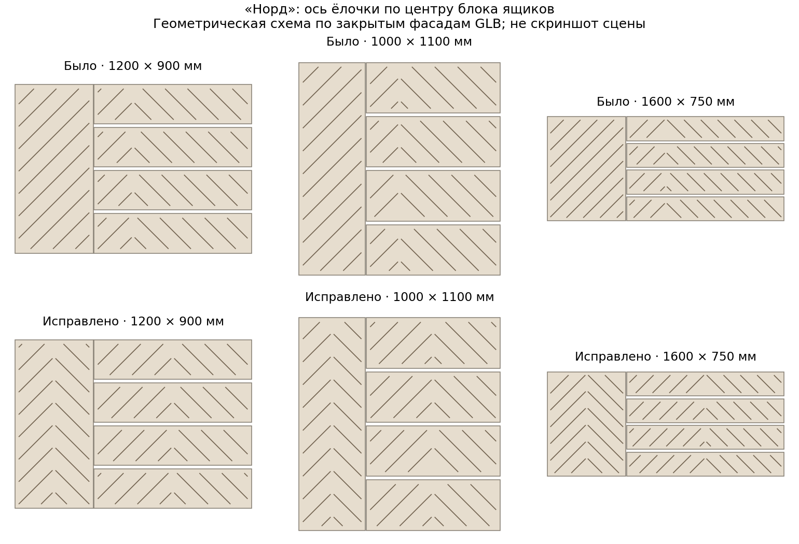

# Общая ёлочка на комодах v1 — исправление 1.1

После проверки пользователь заметил смещённую ёлочку на ящиках «Норда»
и почти одинаковые варианты у комодов с одной колонкой ящиков.

| Модель | Поведение в редакции 1.1 |
| --- | --- |
| Норд | Своя симметричная ёлочка на двери и общая композиция четырёх ящиков, центрированная по блоку |
| Бруклин | Общая ось между двумя колонками; все шесть ящиков согласованы |
| Марвэл | Одна композиция через двери и центральные ящики |
| Белый комод, 4 ящика | Только обычная «Ёлочка», общий вариант снят с выбора |
| Байкал | Только обычная «Ёлочка», общий вариант снят с выбора |

## Почему «Норд» выглядел неравномерно

У двери примерно треть ширины изделия, у ящиков — две трети. Прежняя ось
проходила через центр всего комода, ближе к левому краю ящиков, поэтому
большая часть каждого ящика заполнялась линиями одного направления.
Это было следствием общей композиции, а не перспективы камеры или освещения.

Теперь дверь и блок ящиков имеют независимые центры. Линии внутри блока
согласованы по общей высоте, а обе стороны каждого фасада зеркальны.
Между дверью и блоком ящиков продолжение линий больше не предполагается.

Обе иллюстрации — геометрические схемы из размеров и положения закрытых
панелей реальных GLB. Это не скриншоты 3D-сцены; линии усилены для чтения.

## Размеры, открывание и сохранения

Угол 45°, шаг 80 мм, профиль 6 × 1,5 мм, поля и минимальная длина фрагмента
24 мм сохраняются. Группы измеряются после изменения размеров в закрытой
позе; степень открытия восстанавливается. Плоскости крепления фасадов,
ручки, метрические UV и материалы не меняются.

У моделей 10/14 старые сессии и ссылки с `herringbone-wide` переходят в
`herringbone`, сохраняя размеры и покрытия. Сброс возвращает исходный стиль
модели. Новые назначения удалённого стиля не допускаются.

Контракт `target.compositionGroup` задаёт группу общей композиции. Отсутствующее
поле оставляет прежний общий контур. У «Норда» группы `door` и `drawers`.
`styleFallbacks` задаёт явный переход снятого с выбора стиля в поддерживаемый.
`wideDescription` даёт пояснение для конкретной модели в интерфейсе.
Источник JSON и TypeScript-каталог обновлены согласованно. Стандарт v2.17.

Пакет содержит первоначальный этап комодов и исправление 1.1. Его можно
распаковать поверх предыдущего пакета; список файлов для коммита тот же путь.
[Проверки](wide-herringbone-dressers-v1-validation.md).
