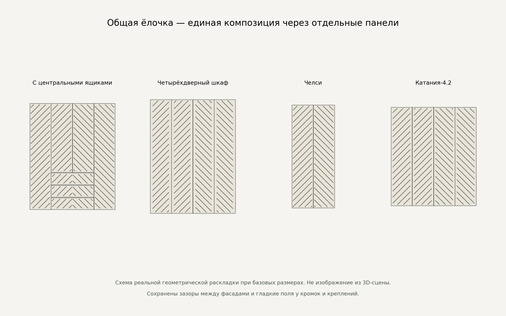

# Общая ёлочка v1

Этап после принятого пользователем `diamonds-facades-v1`, ревизии 1.1.

## Поведение

В «Рисунке фасадов» добавлена карточка **«Общая ёлочка»** для четырёх
шкафов: с центральными ящиками (07), четырёхдверного (08), «Челси» (09)
и «Катании-4.2» (15). Одна композиция занимает всю закрытую переднюю
поверхность, включая ящики модели 07. Обычная «Ёлочка» по-прежнему строит
отдельный рисунок на каждой двери или ящике.

Рисунок пересчитывается во время изменения размеров. Линии соседних
панелей согласованы с учётом настоящих межфасадных зазоров. У каждой
панели остаются гладкие поля по периметру и под креплениями ручек,
поэтому согласованные линии прерываются в этих полях. Канавки не переходят
через физический зазор и не объединяют подвижные детали.

Двери и ящики открываются независимо. При закрывании композиция снова
совмещается. Материалы корпуса, фасадов и фурнитуры выбираются отдельно.
Стиль сохраняется в сессии и ссылке v3. Сброс возвращает исходный стиль
модели; «Катания» сохраняет начальную глубину 450 мм.

Это схема раскладки из фактических размеров и положений панелей GLB,
не скриншот 3D-сцены. Цвет и толщина линий на схеме служат для чтения узора.

## Геометрия и совместимость

ID — `herringbone-wide`. Выбор включён только в `styles` четырёх шкафов,
в исходных `facade-variants.json`, каталогах и runtime-конфигурации «Катании».
Отдельных GLB и дополнительных зависимостей нет.

Профиль совпадает с обычной ёлочкой: угол 45°, шаг 80 мм по нормали,
ширина канавки 6 мм, глубина 1,5 мм, закруглённые окончания. Центральная
гладкая полоса всей композиции — 12 мм. Краевые и монтажные поля конкретной
модели сохраняются. Короткие остатки менее 24 мм пропускаются. Профиль,
толщина панели, задняя монтажная плоскость и масштаб материала не меняются.

После изменения корпуса контроллер измеряет контур всех закрытых фасадов
в системе координат модели. Центр этого контура становится общей осью.
Раскладка переводится в координаты каждой панели и обрезается по её полям.
Разная высота створок и ящиков не сбивает фазу линий. После resize в открытом
состоянии `withClosedPose` возвращает прежнюю степень открытия.

Поворот, перенос и масштаб размещения модели в сцене не меняют композицию.
Кэш хранит только текущий набор и учитывает смещение каждого фрагмента
от общего центра. Одинаковые по размеру панели могут иметь разные фрагменты.
Освобождение геометрий и обработка ошибки перестроения сохранены.

Уточнение неподвижного изображения применяется и к новому стилю.
Муар в движении — прежняя отдельная задача. Комоды пока не получают
общую ёлочку; неизвестный для модели стиль в ссылке заменяется её умолчанием.

Стандарт: `docs/3d-furniture-asset-standard.md`, **v2.15**, раздел 40.
Проверки и границы: [wide-herringbone-v1-validation.md](wide-herringbone-v1-validation.md).
